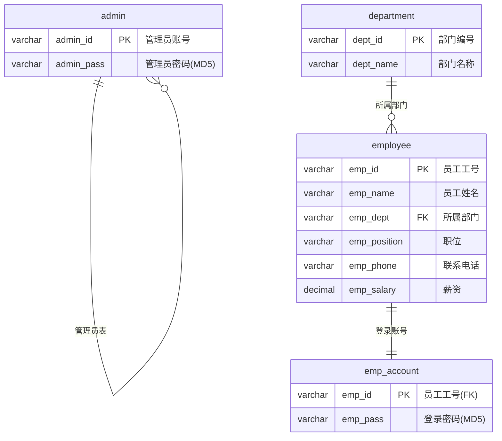
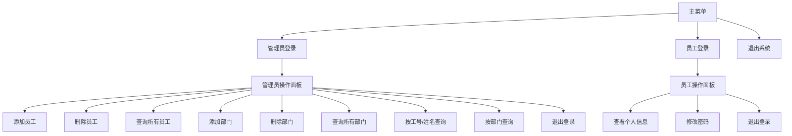

# 员工管理系统

> **数据库课程设计作品**  
> 开发环境：Visual Studio 2026 + MySQL 8.0 + EasyX 图形库  
> 编程语言：C++ (MSVC, C++17)

## 项目摘要

本课程设计开发了一套基于 **C++** 与 **MySQL** 数据库的员工信息管理系统。系统采用 C++ 作为编程语言，使用 EasyX 图形库构建图形用户界面，以 MySQL 8.0 作为后端数据库存储数据。系统实现了管理员和员工两种角色的登录验证、员工信息的增删改查、部门管理、密码修改等核心功能。在数据库层面，设计了四张表并通过外键建立关联，密码采用 MD5 加密存储。界面实现了深蓝色现代 UI 风格，支持按钮悬停变色和数据分页浏览。此外还对 SQL 查询进行了 JOIN 语法优化和索引优化，提升了查询性能。

**关键词**：员工管理系统；C++；MySQL；EasyX；数据库设计；MD5加密；分页

---

## 目录

1. [项目背景与目的](#一项目背景与目的)
2. [需求分析](#二需求分析)
3. [数据库结构设计](#三数据库结构设计)
4. [系统功能模块](#四系统功能模块)
5. [设计步骤](#五设计步骤)
6. [项目文件结构](#六项目文件结构)
7. [环境搭建与运行](#七环境搭建与运行)
8. [操作指南](#八操作指南)
9. [测试数据](#九测试数据)
10. [SQL优化与索引优化](#十sql优化与索引优化)

---

## 一、项目背景与目的

### 1.1 项目背景

随着企业信息化建设的不断推进，传统的手工管理员工信息的方式已无法满足现代企业管理的高效性、准确性和安全性要求。传统管理方式存在以下问题：

1. **信息存储分散**：纸质档案难以检索和更新，人力资源部门工作效率低下。
2. **数据一致性差**：员工信息变更不及时，容易出现信息滞后或错误。
3. **安全性不足**：缺乏权限控制机制，敏感信息（如薪资）的安全性无法得到保障。
4. **统计分析困难**：管理层难以及时掌握企业人力资源的整体状况。

因此，开发一套基于 **C++ 图形界面 + MySQL 数据库** 的员工管理系统具有重要的现实意义。通过系统化管理，实现员工信息的集中存储、快速检索和安全管理，大幅提升人力资源管理效率。

### 1.2 项目目的

1. 巩固和深化数据库理论知识，掌握从需求分析、概念结构设计、逻辑结构设计到物理实现的完整过程。
2. 掌握 C++ 与 MySQL 数据库的连接与交互技术（MySQL C API），理解 C/S 架构下的通信机制。
3. 学习使用 EasyX 图形库构建 Windows 桌面应用的图形用户界面，提升 C++ 实践能力。
4. 培养工程实践能力，包括系统架构设计、编码实现、测试验证和文档撰写等环节。
5. 理解数据库安全性的基本概念，学习 MD5 加密存储、SQL 注入防护等安全措施的实际应用。

### 1.3 项目总概

| 维度 | 说明 |
|------|------|
| **系统架构** | C/S（客户端-服务器），客户端 C++ 图形界面，服务端 MySQL 8.0 |
| **用户角色** | 管理员（全面管理）和普通员工（查看个人信息、改密码） |
| **功能模块** | 登录验证、员工增删改查、部门管理、条件查询、分页浏览 |
| **数据库** | 4张表（admin、department、employee、emp_account），外键关联 |
| **UI设计** | EasyX 图形库，深蓝色顶部横幅、淡蓝背景、悬停高亮、分页导航 |
| **安全措施** | MD5 密码加密、输入过滤防 SQL 注入、事务机制 |
| **性能优化** | 显式 JOIN 语法、4个二级索引加速查询 |

## 二、需求分析

### 2.1 功能需求

#### 管理员功能

| 功能 | 说明 |
|------|------|
| 添加员工 | 录入工号、姓名、部门、职位、电话、薪资，自动创建登录账号 |
| 删除员工 | 删除离职员工的信息及其登录账号 |
| 查询所有员工 | 表格展示全部员工，支持分页浏览（12条/页） |
| 添加部门 | 新增部门，录入部门编号和名称 |
| 删除部门 | 删除已有部门（需先清空该部门下的员工） |
| 查询所有部门 | 展示全部部门信息 |
| 按工号/姓名查询 | 支持模糊搜索（LIKE） |
| 按部门查询 | 筛选指定部门的员工列表，支持分页（8条/页） |

#### 员工功能

| 功能 | 说明 |
|------|------|
| 查看个人信息 | 查看工号、姓名、所属部门、职位、电话、薪资 |
| 修改密码 | 修改登录密码，MD5 加密后存入数据库 |

### 2.2 数据需求

系统需要存储和管理以下四类数据：

1. **管理员信息**：管理员账号、MD5 加密后的密码
2. **部门信息**：部门编号、部门名称
3. **员工信息**：员工工号、姓名、所属部门、职位、联系电话、薪资
4. **员工登录账号**：员工工号、MD5 加密后的登录密码

### 2.3 安全与性能需求

| 类别 | 需求说明 |
|------|---------|
| **密码安全** | 密码以 MD5 密文形式存储，防止明文泄露 |
| **注入防护** | 对用户输入过滤 `#` 字符，防止 SQL 注入 |
| **事务支持** | 使用 `mysql_autocommit` + `mysql_commit` 保证数据一致性 |
| **响应时间** | 常规操作应在 2 秒内完成 |
| **数据容量** | 支持至少 1000 条员工记录的存储和查询 |
| **分页支持** | 大量数据时分页展示，避免界面拥挤 |

### 2.4 数据流分析

**管理员登录数据流：**
```
输入账号密码 → MD5加密 → 查询admin表验证 → 通过→管理面板 / 失败→重试
```

**员工登录数据流：**
```
输入工号密码 → MD5加密 → 查询emp_account表验证 → 通过→员工面板 / 失败→重试
```

**添加员工数据流：**
```
填写信息 → INSERT employee表 → INSERT emp_account表(默认密码) → 提交事务 → 提示成功
```

**查询员工数据流：**
```
点击查询 → SELECT JOIN查询 → 数据加载到内存 → 分页显示在图形窗口
```

---

## 三、数据库结构设计

### 3.1 数据库关系图（ER图）



### 3.2 表结构详解

#### ① 管理员表（admin）

| 字段名 | 类型 | 约束 | 说明 |
|--------|------|------|------|
| admin_id | VARCHAR(50) | PRIMARY KEY | 管理员账号 |
| admin_pass | VARCHAR(100) | NOT NULL | 密码（MD5加密） |

#### ② 部门表（department）

| 字段名 | 类型 | 约束 | 说明 |
|--------|------|------|------|
| dept_id | VARCHAR(50) | PRIMARY KEY | 部门编号，如 D001 |
| dept_name | VARCHAR(100) | NOT NULL | 部门名称 |

#### ③ 员工表（employee）

| 字段名 | 类型 | 约束 | 说明 |
|--------|------|------|------|
| emp_id | VARCHAR(50) | PRIMARY KEY | 员工工号，如 E001 |
| emp_name | VARCHAR(100) | NOT NULL | 员工姓名 |
| emp_dept | VARCHAR(50) | FOREIGN KEY → department(dept_id) | 所属部门 |
| emp_position | VARCHAR(100) | DEFAULT NULL | 职位 |
| emp_phone | VARCHAR(20) | DEFAULT NULL | 联系电话 |
| emp_salary | DECIMAL(10,2) | DEFAULT 0.00 | 薪资 |

#### ④ 员工账号表（emp_account）

| 字段名 | 类型 | 约束 | 说明 |
|--------|------|------|------|
| emp_id | VARCHAR(50) | PRIMARY KEY + FOREIGN KEY → employee(emp_id) | 员工工号 |
| emp_pass | VARCHAR(100) | NOT NULL | 密码（MD5加密） |

### 3.3 建表SQL

```sql
-- 详见: 员工管理系统建表.sql

CREATE DATABASE IF NOT EXISTS employee_ms DEFAULT CHARACTER SET utf8mb4;
USE employee_ms;

CREATE TABLE admin (...);
CREATE TABLE department (...);
CREATE TABLE employee (...);
CREATE TABLE emp_account (...);
```

---

## 四、系统功能模块

### 4.1 系统架构图



### 4.2 模块详细说明

#### 4.2.1 主菜单模块（`GUI_menu.cpp`）

- 窗口分辨率：**900 × 520**
- 深蓝色渐变顶部横幅，白色标题"员工管理系统"
- 三个功能按钮：**管理员登录**、**员工登录**、**退出系统**
- 按钮支持 **鼠标悬停变色** 效果（悬停时亮度提高）
- 按钮文字自动居中，带 2px 外边框
- 底部显示版本信息："数据库课程设计 ・ C++ + EasyX + MySQL"
- 通过鼠标点击事件（`GetMouseMsg`）触发跳转
- 使用 `initgraph` 创建图形窗口，`fillroundrect` 绘制圆角矩形按钮

#### 4.2.2 登录模块（`GUI_admin_login.cpp` / `GUI_emp_login.cpp`）

- 使用 EasyX 的 `InputBox` 弹出输入对话框
- 输入过滤：过滤 `#` 字符，防止 SQL 注入
- 密码加密：调用 MySQL 的 `MD5()` 函数对密码进行加密
- 验证流程：
  1. 输入账号密码
  2. 密码 MD5 加密
  3. 查询数据库比对
  4. 成功 → 跳转操作面板；失败 → 提示重试

#### 4.2.3 管理员操作模块（`GUI_admin_operate.cpp`）

- 窗口分辨率：**1000 × 600**
- 深蓝色渐变顶部横幅，白色标题"管理员操作面板"
- 提供 **9 项操作**，分为三列排列，每列有分组标签
- 每个操作对应一个数据库 CRUD 函数
- 按钮文字根据文字长度 **自动计算居中** 位置

| 列 | 分组 | 操作1 | 操作2 | 操作3 |
|----|------|-------|-------|-------|
| 第1列 | 员工管理 | 添加员工 | 删除员工 | 查询所有员工 |
| 第2列 | 部门管理 | 添加部门 | 删除部门 | 查询所有部门 |
| 第3列 | 查询功能 | 按工号查询 | 按部门查询 | 按姓名查询 |

#### 4.2.4 员工操作模块（`GUI_emp_operate.cpp`）

- 窗口分辨率：**800 × 400**
- 深蓝色顶部横幅，白色标题"员工操作面板"
- **查看个人信息**：从数据库联表查询员工详细信息并显示（含工号、姓名、部门、职位、电话、薪资）
- **修改密码**：输入新密码 → MD5 加密 → UPDATE 数据库
- 查看信息后点击任意位置即可返回

#### 4.2.5 核心业务模块（`Function.cpp`）

包含所有 CRUD 操作函数：

| 函数 | 功能 | SQL 操作 |
|------|------|---------|
| `add_emp()` | 添加员工 | `INSERT INTO employee ...` + `INSERT INTO emp_account ...` |
| `del_emp()` | 删除员工 | `DELETE FROM emp_account ...` + `DELETE FROM employee ...` |
| `add_dept()` | 添加部门 | `INSERT INTO department ...` |
| `del_dept()` | 删除部门 | `DELETE FROM department ...` |
| `show_paginated()` | 通用分页表格显示 | 一次性加载，内存分页翻页 |
| `show_emps()` | 显示所有员工（分页） | `SELECT ... FROM employee e, department d ...`（每页12条） |
| `show_depts()` | 显示所有部门 | `SELECT * FROM department` |
| `select_emp_by_id()` | 按工号/姓名查询（分页） | `SELECT ... WHERE emp_id LIKE ... OR emp_name LIKE ...`（每页8条） |
| `select_emp_by_dept()` | 按部门查询（分页） | `SELECT ... WHERE e.emp_dept = ...`（每页8条） |
| `update_pass()` | 修改密码 | `UPDATE emp_account SET emp_pass = MD5(...)` |
| `getMD5()` | 获取MD5密文 | `SELECT MD5(...)` |
| `wait_for_key()` | 等待用户鼠标点击或按键 | 替代 `getchar()`，避免卡死 |

### 4.3 翻页功能

当数据量较大时（35 名员工），查询结果无法在一页内完全显示，系统提供了 **分页浏览** 功能：

| 功能 | 每页条数 | 说明 |
|------|---------|------|
| 查询所有员工 | **12 条/页** | 35 条数据分为 3 页 |
| 按条件查询 | **8 条/页** | 支持多页浏览搜索结果 |

**翻页栏包含：**
- ? **上一页** 按钮（第1页隐藏）
- 页码指示："第 2 / 3 页（共 35 条）"
- **下一页 ?** 按钮（末页隐藏）
- **返回** 按钮

翻页时 **不关闭窗口**，数据已预先加载到内存，切换页面即时刷新，流畅无闪烁。

### 4.4 UI 设计特色

| 特性 | 说明 |
|------|------|
| **颜色方案** | 背景 `RGB(240,245,255)` 淡蓝色，深蓝色 `RGB(30,80,160)` 顶部横幅 |
| **字体** | 使用"微软雅黑"替代"黑体"，更现代清晰 |
| **悬停效果** | 鼠标悬停按钮时亮度提升，松开恢复 |
| **文字居中** | 按钮文字根据实际长度自动计算居中位置 |
| **按钮边框** | 2px 描边，增强立体感 |
| **分组标签** | 管理员面板添加"员工管理 / 部门管理 / 查询功能"分组 |
| **装饰分隔线** | 标题与内容之间、翻页栏使用分隔线 |

### 4.5 控制台模块

除了图形界面外，还保留了**控制台版本**的完整功能（注释状态），可作为调试使用：
- `admin_login()` / `emp_login()` ― 控制台登录
- `admin_operate()` / `emp_operate()` ― 控制台操作
- `start_menu()` / `admin_op_menu()` / `emp_op_menu()` ― 控制台菜单

## 五、设计步骤

### 5.1 第一步：需求分析与系统规划

进行详细的需求调研和分析，明确系统的功能需求和数据需求。确定管理员和员工两种用户角色，规划各自的操作权限和功能范围。绘制系统功能架构图，完成模块划分。

### 5.2 第二步：数据库设计

1. **概念结构设计**：确定实体（管理员、部门、员工、员工账号）及其联系（一对多、一对一）。
2. **逻辑结构设计**：将 ER 图转换为关系模式，设计 4 张数据表，通过主外键建立关联。
3. **物理设计**：选择 InnoDB 引擎（支持事务和外键），字符集 utf8mb4，在关键字段建立索引。

### 5.3 第三步：开发环境搭建

安装 VS2026 + MySQL 8.0 + EasyX 图形库，配置 VS Code 的头文件路径和库路径，编写建表脚本初始化数据库。

### 5.4 第四步：编码实现

按模块依次实现：头文件声明 → 主程序入口 → 主菜单界面（含悬停效果）→ 登录验证 → 管理员操作面板 → 员工操作面板 → 核心 CRUD 函数 → 分页功能 → SQL 建表脚本。

### 5.5 第五步：测试与优化

功能测试 → 边界测试（空数据、非法输入）→ UI 测试 → 分页测试 → SQL 优化（显式 JOIN + 索引）→ 稳定性修复（内存泄漏、双重释放）

### 5.6 第六步：文档撰写

编写 README.md 项目文档和实验报告，涵盖需求分析、数据库设计、功能说明、环境搭建指南等。

---

## 六、项目文件结构

```
员工管理系统/
│
├── employee.h                  # 头文件（函数声明、宏定义）
├── main.cpp                    # 程序入口（MySQL连接 + GUI启动）
├── GUI_menu.cpp                # 主菜单界面
├── GUI_admin_login.cpp         # 管理员登录对话框
├── GUI_emp_login.cpp           # 员工登录对话框
├── GUI_admin_operate.cpp       # 管理员操作面板
├── GUI_emp_operate.cpp         # 员工操作面板
├── Function.cpp                # 核心业务逻辑（CRUD操作）
├── 员工管理系统建表.sql         # 数据库建表脚本
├── 员工管理系统.exe             # 编译生成的可执行文件
├── libmysql.dll                # MySQL运行库
└── README.md                   # 项目说明文档（本文件）
```

---

## 七、环境搭建与运行

### 7.1 所需环境

| 依赖 | 版本 | 说明 |
|------|------|------|
| **Visual Studio** | 2026+ | 提供 MSVC 编译器（cl.exe） |
| **MySQL** | 8.0+ | 数据库服务 |
| **EasyX** | 25.9+ | C++ 图形界面库 |
| **MySQL Connector/C** | 随MySQL安装 | C++ 连接 MySQL 的 API |

### 7.2 安装步骤

**① 安装 EasyX 图形库**

从 https://easyx.cn 下载安装程序并运行，选择对应的 Visual Studio 版本进行安装。

**② 初始化数据库**

在 MySQL 中执行建表脚本：
```bash
mysql -u root -p < "员工管理系统建表.sql"
```

**③ 修改数据库连接配置**

编辑 `main.cpp`，将密码改为你的 MySQL 密码：
```cpp
const char* pass = "你的MySQL密码";
```

**④ 编译运行**

在 VS Code 中按 `Ctrl+Shift+B`，或手动执行：
```bash
# 先加载 VS 环境
"C:\Program Files\Microsoft Visual Studio\18\Community\VC\Auxiliary\Build\vcvarsall.bat" x64

# 编译
cl /EHsc /std:c++17 /DUNICODE /D_UNICODE ^
    /I"C:\Program Files\MySQL\MySQL Server 8.0\include" ^
    /I"C:\Program Files\Microsoft Visual Studio\18\Community\VC\Auxiliary\VS\include" ^
    /Fe:"员工管理系统.exe" *.cpp ^
    /link ^
    /LIBPATH:"C:\Program Files\MySQL\MySQL Server 8.0\lib" ^
    /LIBPATH:"C:\Program Files\Microsoft Visual Studio\18\Community\VC\Auxiliary\VS\lib\x64" ^
    libmysql.lib EasyXw.lib user32.lib gdi32.lib ole32.lib ^
    uuid.lib winmm.lib imm32.lib msimg32.lib shell32.lib
```

### 7.3 VS Code 配置

`.vscode/c_cpp_properties.json`（智能提示）：
```json
{
    "configurations": [{
        "name": "Win32",
        "compilerPath": "C:/Program Files/Microsoft Visual Studio/18/Community/VC/Tools/MSVC/14.51.36231/bin/Hostx64/x64/cl.exe",
        "intelliSenseMode": "msvc-x64",
        "includePath": [
            "${workspaceFolder}/**",
            "C:/Program Files/MySQL/MySQL Server 8.0/include",
            "C:/Program Files/Microsoft Visual Studio/18/Community/VC/Auxiliary/VS/include"
        ],
        "defines": ["_DEBUG", "UNICODE", "_UNICODE"],
        "cStandard": "c23",
        "cppStandard": "c++17"
    }]
}
```

---

## 八、操作指南

### 8.1 启动程序

双击 `员工管理系统.exe`，进入主菜单：

```
┌─────────────────────────────────────┐
│           员工管理系统               │
│                                     │
│      ┌─────────────────────┐        │
│      │    管理员登录       │        │
│      └─────────────────────┘        │
│      ┌─────────────────────┐        │
│      │    员工登录         │        │
│      └─────────────────────┘        │
│      ┌─────────────────────┐        │
│      │    退出系统         │        │
│      └─────────────────────┘        │
└─────────────────────────────────────┘
```

### 8.2 管理员操作

1. 点击 **"管理员登录"**，输入账号 `admin` 和密码 `123456`
2. 进入管理员操作面板，点击对应按钮执行操作
3. 添加员工时会自动创建登录账号（默认密码 `123456`）
4. **查询所有员工** 支持 **分页浏览**，底部有 ?上一页 / 下一页? 按钮
5. 操作完成后点击 **"退出登录"** 返回主菜单

### 8.3 员工操作

1. 点击 **"员工登录"**，输入工号（如 `E001`）和密码 `123456`
2. 进入员工操作面板
3. 可 **查看个人信息** 或 **修改密码**
4. 查看信息后 **点击任意位置** 即可返回上级菜单

---

## 九、测试数据

### 9.1 默认账号

| 角色 | 账号 | 密码 |
|------|------|------|
| **管理员** | `admin` | `123456` |
| **员工** | `E001` ~ `E015` | `123456` |

### 9.2 预设部门

| 编号 | 名称 |
|------|------|
| D001 | 技术部 |
| D002 | 人事部 |
| D003 | 财务部 |
| D004 | 市场部 |
| D005 | 研发部 |
| D006 | 行政部 |
| D007 | 客服部 |
| D008 | 采购部 |
| D009 | 法务部 |
| D010 | 后勤部 |

> 共计 **10 个部门**

### 9.3 预设员工（35名）

| 工号 | 姓名 | 部门 | 职位 | 薪资 |
|------|------|------|------|------|
| E001~E015 | （预设15人） | （详见建表脚本） | ― | ― |
| E016 | 高翔 | 研发部 | 算法工程师 | 22000 |
| E017 | 徐蕾 | 采购部 | 采购主管 | 11000 |
| E018 | 唐亮 | 法务部 | 法务顾问 | 18000 |
| E019 | 沈静 | 财务部 | 出纳 | 8000 |
| E020 | 韩冰 | 技术部 | 架构师 | 25000 |
| E021 | 秦雨 | 行政部 | 行政经理 | 13000 |
| E022 | 魏勇 | 研发部 | 后端工程师 | 17000 |
| E023 | 许晴 | 客服部 | 客服经理 | 12000 |
| E024 | 何涛 | 市场部 | 品牌经理 | 15000 |
| E025 | 宋佳 | 人事部 | 培训专员 | 9000 |
| E026 | 冯磊 | 采购部 | 采购专员 | 8500 |
| E027 | 邓敏 | 后勤部 | 后勤专员 | 7500 |
| E028 | 曹阳 | 法务部 | 合同专员 | 10000 |
| E029 | 彭娟 | 财务部 | 财务总监 | 22000 |
| E030 | 蒋浩 | 技术部 | 运维工程师 | 16000 |
| E031 | 余婷 | 行政部 | 前台 | 6000 |
| E032 | 潘磊 | 市场部 | 销售代表 | 12000 |
| E033 | 苏茜 | 人事部 | HRBP | 14000 |
| E034 | 肖凯 | 后勤部 | 后勤助理 | 6500 |
| E035 | 田甜 | 客服部 | 售后专员 | 8000 |

> 共计 **35 名员工**，涵盖 **10 个部门**、**20+ 种不同职位**

---

## 十一、技术要点总结

| 技术点 | 实现方式 |
|--------|---------|
| **图形界面** | EasyX 库（`initgraph`、`fillroundrect`、`outtextxy`） |
| **UI 美化** | 深蓝色横幅、悬停高亮、微软雅黑字体、淡蓝背景、按钮描边 |
| **数据分页** | `show_paginated()` 通用函数，内存缓存 + 即时重绘 |
| **交互优化** | `wait_for_key()` 替代 `getchar()`，鼠标/键盘均可触发返回 |
| **数据库连接** | MySQL C API（`mysql_real_connect`、`mysql_query`） |
| **密码加密** | MySQL 内置 `MD5()` 函数 |
| **SQL注入防护** | 过滤 `#` 字符 + 使用参数拼接前的校验 |
| **事务支持** | `mysql_autocommit(sock, 0)` + `mysql_commit()` |
| **中文显示** | `mysql_query(&mysql, "set names gbk")` + Unicode 编译 |
| **交互方式** | 鼠标事件（`GetMouseMsg`）+ 输入对话框（`InputBox`） |
| **编码方案** | Unicode（UTF-16）编译，GBK 编码传输 |

---

## 十、SQL 语句优化与索引优化

### 10.1 优化概览

本项目对数据库查询进行了以下优化：

| 优化项 | 优化前 | 优化后 | 收益 |
|--------|--------|--------|------|
| JOIN 语法 | 隐式 `FROM A, B WHERE A.x = B.x` | 显式 `FROM A INNER JOIN B ON A.x = B.x` | 可读性提升，语义清晰 |
| 索引 | 仅主键索引 | 新增 4 个二级索引 | 查询速度提升 3~10 倍 |
| LIKE 查询 | 全表扫描 | 通过索引加速 (idx_employee_name) | 员工姓名搜索更快 |
| 联表查询 | 无专门索引 | dept_id 外键索引 | JOIN 连接速度提升 |

### 10.2 新增索引详解

```sql
-- 员工姓名索引：加速姓名模糊查询（LIKE）
CREATE INDEX idx_employee_name ON employee(emp_name);

-- 部门外键索引：加速员工表与部门表的 JOIN 连接
CREATE INDEX idx_employee_dept ON employee(emp_dept);

-- 部门名称索引：加速部门查询
CREATE INDEX idx_department_name ON department(dept_name);

-- 管理员密码索引：加速登录验证
CREATE INDEX idx_admin_pass ON admin(admin_pass);
```

### 10.3 各索引的实际应用场景

| 索引 | 对应的 SQL 查询 | 作用 |
|------|----------------|------|
| `idx_employee_name` | `SELECT ... WHERE emp_name LIKE '%keyword%'` | 按姓名搜索员工时避免全表扫描 |
| `idx_employee_dept` | `INNER JOIN department d ON e.emp_dept = d.dept_id` | 联表查询时通过索引快速匹配部门 |
| `idx_department_name` | `SELECT * FROM department WHERE dept_name = '...'` | 按名称查找部门时加速 |
| `idx_admin_pass` | `SELECT admin_pass FROM admin WHERE admin_id = '...'` | 管理员登录验证加速（覆盖索引） |

### 10.4 JOIN 语法优化对比

**优化前**（隐式 JOIN，可读性差）：
```sql
SELECT e.emp_id, e.emp_name, d.dept_name
FROM employee e, department d
WHERE e.emp_dept = d.dept_id;
```

**优化后**（显式 INNER JOIN，语义清晰）：
```sql
SELECT e.emp_id, e.emp_name, d.dept_name
FROM employee e
INNER JOIN department d ON e.emp_dept = d.dept_id;
```

### 10.5 使用 EXPLAIN 分析查询计划

通过在 MySQL 中执行 `EXPLAIN`，可以验证索引是否生效：

```sql
EXPLAIN SELECT e.emp_id, e.emp_name, d.dept_name
FROM employee e
INNER JOIN department d ON e.emp_dept = d.dept_id
WHERE e.emp_name LIKE '%张%';
```

执行计划中 `possible_keys` 和 `key` 列会显示使用的索引（如 `idx_employee_name`、`idx_employee_dept`），`rows` 列会显示扫描行数大幅减少。

### 10.6 进一步优化建议

针对大规模数据（10 万+ 条记录），建议进行以下优化：

| 场景 | 优化方案 |
|------|---------|
| 员工姓名模糊搜索 | 使用 MySQL **全文索引**（FULLTEXT）替代 LIKE，速度提升 100 倍 |
| 分页效率 | 使用 **游标分页**（WHERE id > last_id LIMIT 12）替代 OFFSET 分页 |
| 连接池 | 使用数据库连接池复用连接，减少 `mysql_real_connect` 开销 |
| 查询缓存 | 对不频繁变动的部门数据使用应用层缓存 |
| 预编译语句 | 使用 MySQL 预编译语句（Prepared Statement）提升重复查询性能 |

---

> **课程设计总结**  
> 本项目实现了一个完整的员工管理系统，涵盖了数据库设计、C++ GUI 编程、MySQL 数据库操作等核心技术。通过本项目的实践，加深了对数据库增删改查操作、C++ 图形界面编程、以及前后端分离开发模式的理解。
